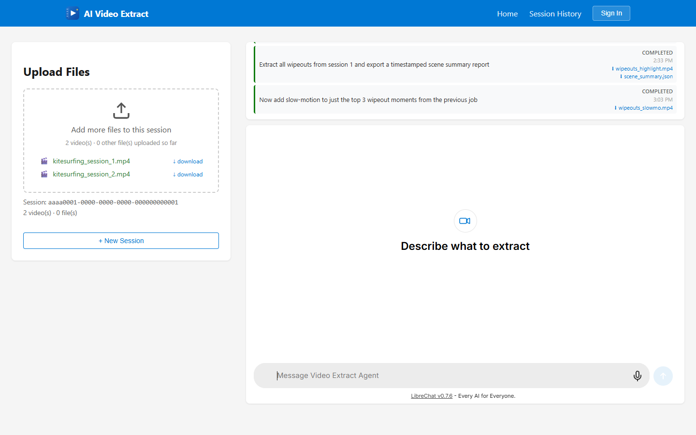
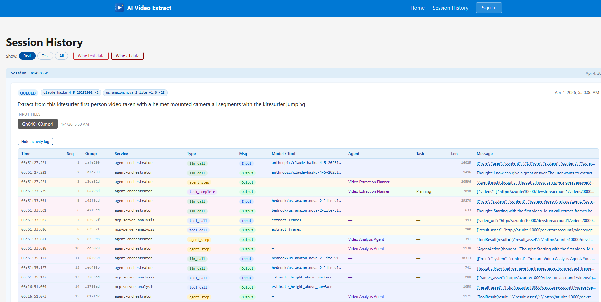
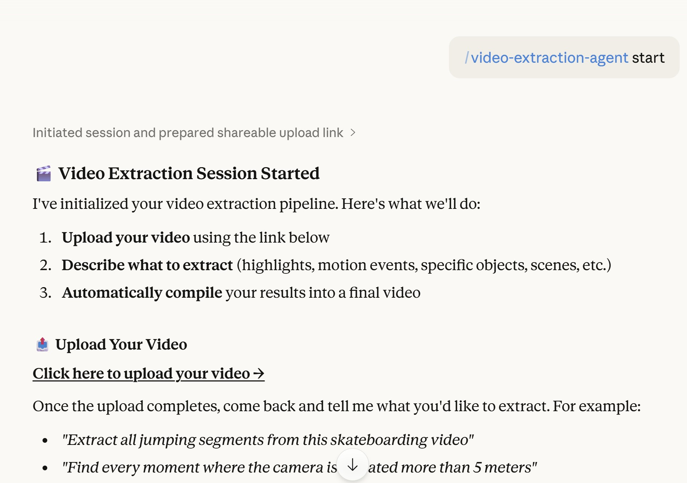
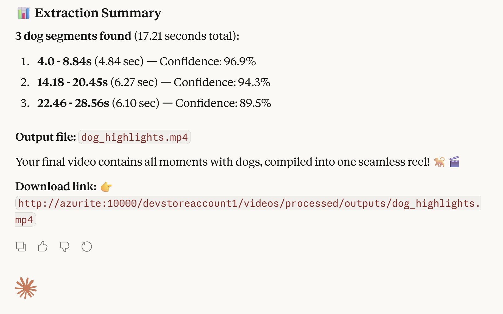
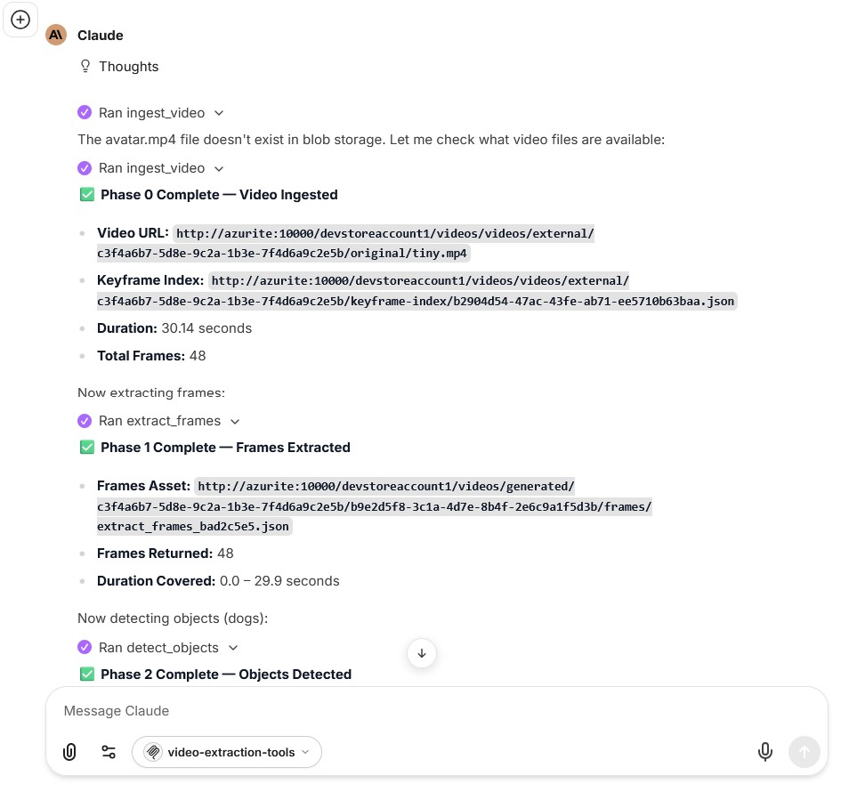
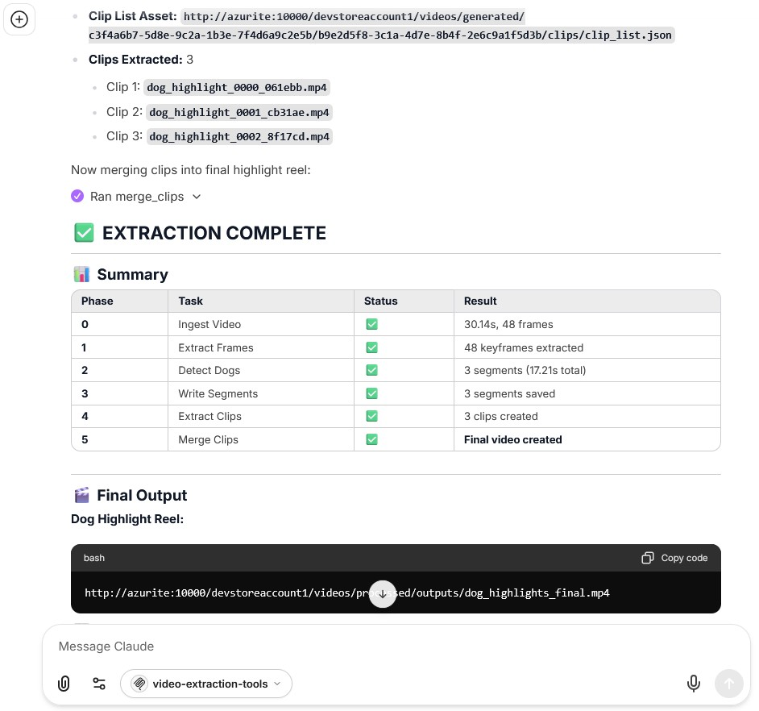

This project is a complete redesign of the original Video Extract tool.

Original implementation:
https://github.com/cibis/video_extract

---

# Video Extract Agents

A prompt-driven video extraction platform. Upload a video, describe what you want in plain English, and AI agents extract and compile the relevant segments into a highlight reel.

> **Example:** *"Extract all kitesurfing jumps from this video and compile them into a highlight reel."*

---

## Why This Exists

This project exists because I have a problem. Two problems, actually.

The first: I'm mildly obsessed with agentic AI, the idea that you give a system a goal in plain English and a crew of AI agents figures out how to get there. The second: I have *hours* of kitesurfing footage and zero patience for scrubbing through it frame by frame looking for the good jumps.

The obvious solution was to build an enterprise-grade, cloud-native, multi-agent video extraction platform. Most people would have just used iMovie. I am not most people.

So here we are: a full Azure microservices stack, CrewAI orchestration, MCP tool servers, and FFmpeg keyframe pipelines, all so I can type *"find the jumps"* and go back to the beach.

---

## Table of Contents

- [Overview](#overview)
- [How It Works](#how-it-works)
- [Tech Stack](#tech-stack)
- [Quick Start (Local Dev)](#quick-start-local-dev)
- [Running Tests](#running-tests)
- [Documentation](#documentation)
- [External Agents](#external-agents)
- [Repository Structure](#repository-structure)

---

## Overview

The platform combines agentic AI orchestration (CrewAI + Claude), MCP tool servers over SSE transport, and a cloud-native Azure microservices architecture to enable natural-language-driven video processing at scale.

| Home — session active with completed job history and chat | Session History — completed and failed jobs with output files |
|---|---|
|  |  |

Key capabilities:

- Upload videos up to 10 GB directly to Azure Blob Storage
- Describe what to extract in natural language via a chat interface
- AI agents (planner → analysis → processing) orchestrate the full pipeline
- FFmpeg keyframe pre-processing dramatically reduces AI token costs
- Output videos delivered via signed CDN URLs and email notification
- All processing services auto-scale to zero when idle (KEDA on Azure Container Apps)

---

## How It Works

```
Upload video (Angular → Blob Storage via SAS token)
    ↓
Pre-processing worker (FFmpeg keyframe extraction → PostgreSQL index)
    ↓
User submits prompt (LibreChat iframe → API Gateway → Agent Orchestrator)
    ↓
CrewAI crew: Planner → Analysis Agent (MCP tools) → Processing Agent (MCP tools)
    ↓
Output video written to Blob Storage
    ↓
Signed download URL delivered via SSE stream + email notification
```

All steps are asynchronous and fault-tolerant via Azure Service Bus queues.

---

## Tech Stack

| Layer | Technology |
|---|---|
| Frontend | Angular 19 + LibreChat (forked, iframe embed) |
| API / BFF | Node.js + Express (TypeScript) |
| AI Orchestration | Python + CrewAI + FastAPI |
| LLM | Anthropic Claude (via LiteLLM) |
| Tool Protocol | MCP over SSE transport |
| Container Platform | Azure Container Apps + KEDA |
| Infrastructure as Code | Terraform |
| Storage | Azure Blob Storage |
| Database | Azure PostgreSQL (asyncpg + SQLAlchemy async) |
| Messaging | Azure Service Bus |
| Auth | Azure Entra External ID (magic link / JWT) |
| Local Dev Emulation | Docker Compose + Azurite |
| CI/CD | GitLab CI (mirrored to GitHub) |

---

## Quick Start (Local Dev)

Requires Docker Desktop (≥ 4.30) with WSL 2. See [docs/getting-started.md](docs/getting-started.md) for full prerequisites and Azure setup.

**1. Copy environment files:**

```bash
cp backend/api-gateway/.env.example              backend/api-gateway/.env
cp backend/agent-orchestrator/.env.example       backend/agent-orchestrator/.env
cp backend/preprocessing-worker/.env.example     backend/preprocessing-worker/.env
cp backend/notification-worker/.env.example      backend/notification-worker/.env
cp mcp-servers/mcp-server-analysis/.env.example  mcp-servers/mcp-server-analysis/.env
cp mcp-servers/mcp-server-processing/.env.example mcp-servers/mcp-server-processing/.env
cp frontend/librechat/.env.example               frontend/librechat/.env
```

Edit `backend/agent-orchestrator/.env` and set `ANTHROPIC_API_KEY`.

**2. Start the stack:**

```bash
cd infrastructure/docker-compose
docker compose up --build
```

**3. Create Service Bus queues (once, after stack is up):**

```bash
export SERVICE_BUS_CONNECTION_STRING="Endpoint=sb://localhost;SharedAccessKeyName=RootManageSharedAccessKey;SharedAccessKey=SAS_KEY_VALUE;UseDevelopmentEmulator=true;"
python scripts/create_service_bus_queues.py
```

**4. Verify services:**

```bash
curl http://localhost:8000/health   # API Gateway
curl http://localhost:8001/health   # Agent Orchestrator
curl http://localhost:8100/tools    # MCP Analysis tools
curl http://localhost:8200/tools    # MCP Processing tools
```

Services run on:

| Service | Port |
|---|---|
| Angular Shell | http://localhost:4200 |
| LibreChat | http://localhost:3080 |
| API Gateway | http://localhost:8000 |
| Agent Orchestrator | http://localhost:8001 |
| MCP Analysis | http://localhost:8100 |
| MCP Processing | http://localhost:8200 |
| Azurite (Blob) | http://localhost:10000 |
| PostgreSQL | localhost:5433 |

---

## Running Tests

### Unit tests

```bash
# Node.js API Gateway
cd backend/api-gateway && npm ci && npm test

# Python services (same pattern for each)
cd backend/agent-orchestrator && poetry install && poetry run pytest tests/unit/ -v
cd backend/preprocessing-worker && poetry install && poetry run pytest tests/unit/ -v
cd mcp-servers/mcp-server-analysis && poetry install && poetry run pytest tests/unit/ -v
```

### Integration tests

```bash
bash scripts/run-integration-local.sh
```

### E2E tests (fully containerised)

```bash
scripts/run-e2e-local.sh
# With frontier vision tools:
ANTHROPIC_API_KEY=sk-... scripts/run-e2e-local.sh
```

Minimum coverage: **80% per service**.

---

## Documentation

| Document | Description |
|---|---|
| [docs/architecture.md](docs/architecture.md) | System design, data flows, service responsibilities, component details, deployment diagrams |
| [docs/getting-started.md](docs/getting-started.md) | Full setup guide — prerequisites, GitLab/GitHub/Azure configuration, local dev bootstrap, CI/CD variables, secrets reference, troubleshooting |
| [docs/local-development.md](docs/local-development.md) | Local development notes |
| [docs/e2e-tests.md](docs/e2e-tests.md) | End-to-end test details |
| [external-agents/claude-desktop/README.md](external-agents/claude-desktop/README.md) | Claude Desktop MCP integration |
| [external-agents/librechat/README.md](external-agents/librechat/README.md) | LibreChat official image MCP integration |

---

## External Agents

The platform's MCP tools can be used directly from Claude Desktop or the LibreChat official image via an MCP bridge (port 8300) that translates standard MCP JSON-RPC to the platform's SSE tool protocol.

**Claude Desktop:**

```bash
# Start MCP bridge
bash external-agents/claude-desktop/scripts/start-mcp-bridge.sh

# Install config (Windows PowerShell)
.\external-agents\claude-desktop\scripts\install.ps1
# Restart Claude Desktop — Tools icon should show 19 tools
```

| Session started — upload link provided | Job complete — extraction summary and download link |
|---|---|
|  |  |

**LibreChat (official image):**

```bash
cp external-agents/librechat/.env.example external-agents/librechat/.env
# Set ANTHROPIC_API_KEY and generate random secrets (see docs/getting-started.md §13.2)
cd external-agents/librechat && docker compose up -d
# Open http://localhost:3081
```

| Agent running MCP tool calls (ingest → detect → clip) | Extraction complete — final output URL |
|---|---|
|  |  |

See [docs/getting-started.md § External agents](docs/getting-started.md#13-external-agents-librechat-official--claude-desktop) for the full walkthrough.

---

## Repository Structure

```
backend/
  api-gateway/            Node.js + Express (TypeScript) — auth, SAS tokens, SSE, chat proxy
  agent-orchestrator/     Python + CrewAI (FastAPI) — planner/analyst/processor agents
  preprocessing-worker/   Python — FFmpeg keyframe extraction
  notification-worker/    Python — email delivery via Azure Communication Services

mcp-servers/
  mcp-server-analysis/    Port 8100 — extract_frames, detect_motion, detect_objects, transcribe_audio
  mcp-server-processing/  Port 8200 — split_video, extract_clip, merge_clips, transform_video

frontend/
  angular-shell/          Angular 19 — upload UI, job dashboard, LibreChat iframe host
  librechat/              Forked LibreChat — custom endpoint, branding, job status postMessage bridge

external-agents/
  mcp-bridge/             Standard MCP server (port 8300) — SSE + stdio transports
  claude-desktop/         Claude Desktop config + install scripts
  librechat/              LibreChat official image stack
  agent-instructions/     System prompt for external agents

infrastructure/
  docker-compose/         Full local dev stack
  terraform/
    modules/              aca, storage, database (reusable modules)
    envs/                 dev, prod, test (ephemeral per CI pipeline)

tests/
  integration/            Docker Compose integration tests
  fixtures/               Shared test data

scripts/
  init_db.py              Create all database tables
  create_service_bus_queues.py  Create all Service Bus queues

docs/
  architecture.md         System architecture reference
  getting-started.md      Full setup and deployment guide
```
