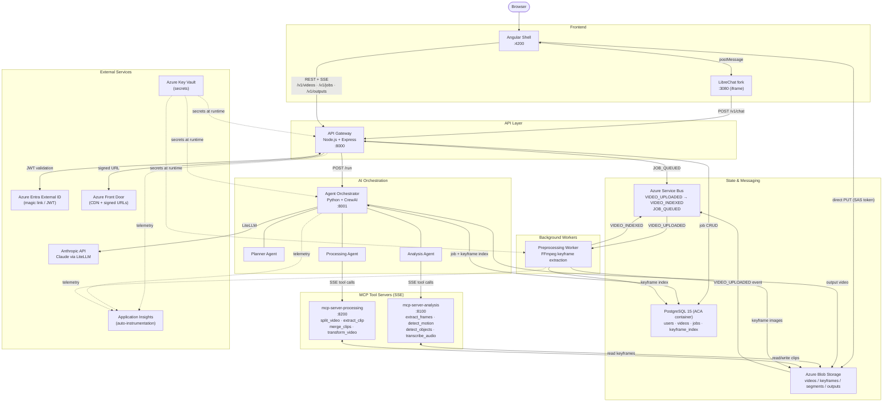
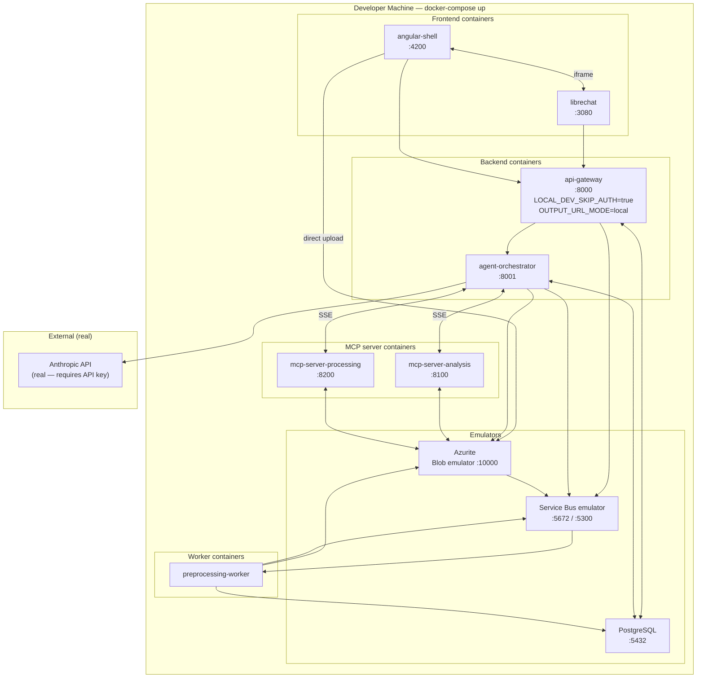
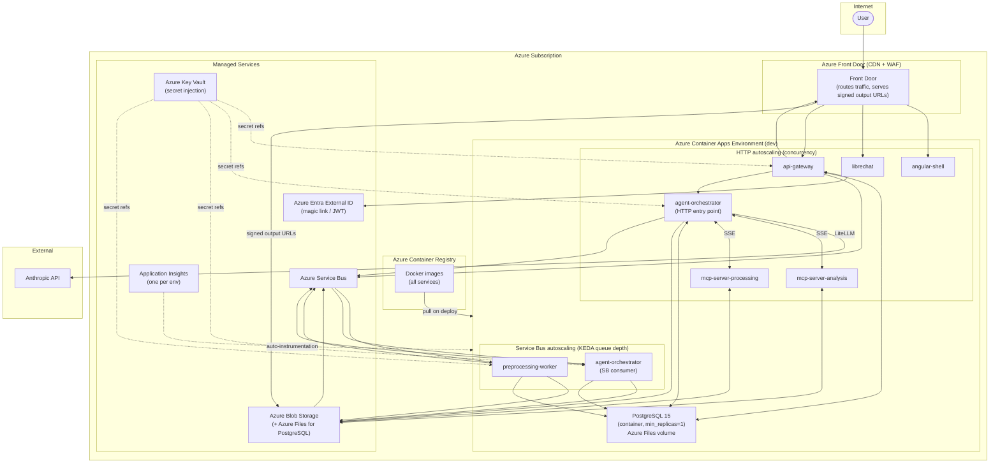

# Architecture — Prompt-Driven Video Extraction Platform

## Table of Contents

- [1. System Overview](#1-system-overview)
- [2. Tech Stack](#2-tech-stack)
- [3. Project Structure](#3-project-structure)
- [4. Data Flow](#4-data-flow)
  - [Upload flow](#upload-flow)
  - [Job execution flow](#job-execution-flow)
  - [Authentication flow](#authentication-flow)
- [5. Core Components](#5-core-components)
- [6. Key Patterns](#6-key-patterns)
- [7. External Integrations](#7-external-integrations)
- [8. Observability](#8-observability)
- [9. Service Ports (local / Docker Compose)](#9-service-ports-local-docker-compose)
- [10. Local Development](#10-local-development)
  - [Env flags](#env-flags)
  - [Running E2E tests locally](#running-e2e-tests-locally)
  - [Files requiring changes](#files-requiring-changes)
- [11. External Agent Support](#11-external-agent-support)
  - [New directory: `external-agents/`](#new-directory-external-agents)
  - [MCP Bridge (port 8300)](#mcp-bridge-port-8300)
  - [`ingest_video` tool](#ingest_video-tool-added-to-mcp-server-analysis)
  - [File-attach flow per agent](#file-attach-flow-per-agent)
  - [Docker Compose integration](#docker-compose-integration)
- [12. System Architecture Diagram](#12-system-architecture-diagram)
- [12. Deployment Diagrams](#12-deployment-diagrams)
  - [12.1 Local — Docker Compose](#121-local-docker-compose)
  - [12.2 Azure — Container Apps (dev / prod)](#122-azure-container-apps-dev-prod)

---

## 1. System Overview

Users upload video files and describe what they want extracted in plain English (e.g., "compile all kitesurfing jumps into a highlight reel"). The platform uses AI agents to interpret the prompt, orchestrate a sequence of MCP tool calls for video analysis and processing, and deliver a compiled output video via a signed CDN URL.

---

## 2. Tech Stack

| Layer | Technology |
|---|---|
| Frontend language | TypeScript |
| Frontend framework | Angular 19 |
| Frontend backend (BFF) | Node.js + Express (TypeScript) |
| Node.js dependency manager | npm |
| Python language | Python 3.11 |
| Python framework | FastAPI + Uvicorn (agent orchestrator + workers + MCP servers) |
| Python dependency manager | Poetry |
| AI orchestration | CrewAI (Python service) |
| LLM routing | LiteLLM (used by CrewAI to call the Anthropic API) |
| AI models | Anthropic Claude (direct API via LiteLLM) |
| MCP tool transport | SSE (Server-Sent Events) |
| Chat UI | LibreChat (forked; iframe embed) |
| Container platform | Azure Container Apps (ACA) |
| Autoscaling | KEDA |
| Infrastructure as Code | Terraform (azurerm ~4.0) |
| Local dev emulation | Docker Compose + Azurite |
| Storage | Azure Blob Storage |
| Database | PostgreSQL 15 (ACA container, Azure Files backed) |
| Messaging | Azure Service Bus |
| Authentication | Azure Entra External ID (magic link / JWT) |
| Secrets | Azure Key Vault (prod); .env files (local) |
| Observability | Azure Application Insights (auto-instrumentation) |
| CI/CD | GitLab CI |
| Container registry | Azure Container Registry |
| CDN / delivery | Azure Front Door |
| Video processing | FFmpeg, OpenCV, Whisper |

---

## 3. Project Structure

```
video-extract-agents/
│
├── backend/
│   ├── api-gateway/            Node.js + Express (TypeScript) — auth, SAS tokens, job CRUD, SSE stream, chat proxy
│   ├── agent-orchestrator/     Python + CrewAI — planner/analyst/processor agents; HTTP + SB consumer
│   └── preprocessing-worker/   Python — FFmpeg keyframe extraction; triggered by VIDEO_UPLOADED
│
├── mcp-servers/
│   ├── mcp-server-analysis/    Python SSE tool server (port 8100): read-only video analysis
│   └── mcp-server-processing/  Python SSE tool server (port 8200): video output artifact production
│
├── frontend/
│   ├── angular-shell/          Angular 19 shell — upload, dashboard, LibreChat iframe host
│   └── librechat/              Forked LibreChat — project customisations in client/src/platform/; routes to /v1/chat
│
├── infrastructure/
│   ├── docker-compose/         Full local stack with Azurite, Postgres, all services
│   └── terraform/
│       ├── modules/            aca, storage, database (reusable)
│       └── envs/               dev, prod, test (ephemeral per CI pipeline)
│
├── tests/
│   └── e2e/                    End-to-end tests (ephemeral Azure + local Docker Compose)
│
└── scripts/
    ├── init_db.py                    Create all database tables
    └── create_service_bus_queues.py  Create all Service Bus queues
```

The `backend/api-gateway/` service is Node.js and has its own:
- `package.json` — npm dependencies
- `tsconfig.json` — TypeScript configuration
- `Dockerfile` — container build
- `.env.example` — required environment variables
- `src/` — application source

All Python services (`backend/agent-orchestrator/`, `backend/preprocessing-worker/`, `mcp-servers/*/`) have their own:
- `pyproject.toml` — Poetry dependencies
- `Dockerfile` — container build
- `.env.example` — required environment variables
- `app/` — application source

`frontend/librechat/` is a fork of upstream LibreChat. Project-specific changes are confined to `client/src/platform/` and root config files (`librechat.yaml`, `.env.example`, `Dockerfile`) to keep upstream merges tractable.

---

## 4. Data Flow

### Upload flow
```
Browser (Angular VideoUploadComponent — multi-file)
  → POST /v1/sessions (API Gateway)            # create session; returns sessionId
  For each video file:
    → POST /v1/videos { sessionId } (API Gateway)  # request SAS write token; video linked to session
    → PUT <uploadUrl> (blob-proxy in local dev, SAS URL in CI/prod)  # browser uploads to Azure Blob
    → Service Bus: VIDEO_UPLOADED { sessionId }
    → Preprocessing Worker                         # FFmpeg keyframe extraction
    → PostgreSQL: video_keyframe_index
    → session_assets: uploaded_video row
    → Service Bus: VIDEO_INDEXED
  For each non-video file (JSON, CSV, TXT, image):
    → POST /v1/assets { sessionId, filename, contentType } (API Gateway)  # request SAS write token
    → PUT <uploadUrl> (blob-proxy in local dev, SAS URL in CI/prod)        # browser uploads to Azure Blob
    → PostgreSQL: assets + session_assets (uploaded_file row)
  Angular shell postMessages { type: 'SESSION_CONTEXT', sessionId, videoIds } to LibreChat iframe
```

### Job execution flow
```
LibreChat iframe (JobStatusBridge attaches X-Session-Id header on all /v1/* requests)
  → POST /v1/chat (Node.js API Gateway)   # proxied chat message; X-Session-Id forwarded
  → POST /run (Agent Orchestrator HTTP)   # Node.js calls Python agent service

POST /v1/jobs (Node.js API Gateway)
  → PostgreSQL: jobs (status=queued)
  → Service Bus: JOB_QUEUED

Agent Orchestrator (Python — SB consumer + HTTP service)
  → reads job + keyframe index from PostgreSQL
  → CrewAI crew kickoff:
      Planner Agent    → interprets prompt → extraction plan
      Analysis Agent   → calls mcp-server-analysis tools (SSE)
      Processing Agent → calls mcp-server-processing tools (SSE)
  → output video written to Blob Storage
  → PostgreSQL: jobs (status=completed, output_url)

GET /v1/jobs/{id}/stream (Node.js API Gateway)
  → SSE stream polling PostgreSQL → pushes status to Angular

Angular shell
  → receives postMessage from LibreChat iframe: { type: 'JOB_COMPLETED', ... }
  → GET /v1/outputs/{id} → signed download URL
```

### Authentication flow
```
Browser → Azure Entra External ID (magic link email)
        → JWT issued
Angular → attaches JWT to every API request header
Node.js API Gateway → validates JWT against Entra JWKS endpoint on every request
```

---

## 5. Core Components

### `backend/api-gateway/src/`
Node.js + Express (TypeScript). The single external entry point for all client traffic. Handles JWT validation (`middleware/auth.ts`), generates short-lived SAS write tokens for direct browser uploads (`routes/videos.ts`), creates jobs and publishes to Service Bus (`routes/jobs.ts`), streams real-time status via SSE (`routes/jobs.ts:streamJobProgress`), and proxies chat messages to the Python agent orchestrator over HTTP (`routes/chat.ts`).

**Session and asset management endpoints:**
- `POST /v1/sessions` — create a session grouping uploads + jobs
- `GET /v1/sessions/:id/assets` — list all session assets with signed URLs
- `POST /v1/assets` — register a non-video uploaded file; creates `assets` + `session_assets` rows
- `GET /v1/assets/:id` — fetch asset metadata + signed URL
- `GET /v1/downloads/:id` — unified signed download endpoint for any `session_asset`
- `GET /v1/jobs/:id/outputs` — list all outputs for a job with signed URLs

`generateSignedDownloadUrl()` in `services/blobService.ts` is the shared signing function used by all download routes. It branches on `OUTPUT_URL_MODE`: returns a direct Azurite URL locally, or an HMAC-SHA256 Front Door signed URL in CI/prod.

### `backend/agent-orchestrator/app/`
Python service with two entry points: an HTTP server (`server.py` — FastAPI, receives `POST /run` calls from the Node.js API gateway) and a Service Bus consumer (`consumer.py` — picks up `JOB_QUEUED` events). Both invoke `crew.py`, which defines the three-agent CrewAI pipeline: **Planner** (interprets prompt → extraction plan), **Analysis** (calls analysis MCP tools), **Processing** (calls processing MCP tools → compiled video). Sequential process; `crew.kickoff()` returns the output blob URL. CrewAI calls the Anthropic API via **LiteLLM** — agents are configured with a `litellm` model string (e.g. `anthropic/claude-sonnet-4-6`).

**Multi-video and session support:**
- `run_crew()` accepts `video_urls: list[str]`, `session_id`, `parent_job_id`, and `extra_asset_urls` (optional asset URLs for sessionless callers / tests)
- `tools/catalogue.py` — `fetch_tool_catalogue()` calls `GET /tools` on all MCP servers at crew startup; planner selects tools at runtime from this dynamic catalogue
- `crew.py` fetches keyframe indices for all videos concurrently, loads session assets and parent job context, and passes the full catalogue as text in the planner prompt; `tasks.py` groups session assets by type (`uploaded_file` vs `uploaded_video`) and instructs the planner to call `read_asset` for non-video files and vision tools for images before planning
- `memory=True` on the Crew enables cross-turn context within a session
- After the processing agent completes, `create_output()` and `create_session_asset()` register the output in PostgreSQL

### `mcp-servers/mcp-server-analysis/app/`
MCP tool server over SSE (port 8100). Exposes `GET /tools` (enriched catalogue with `capability_tags`, `specialization`, `default_model`, `available_models`) and `POST /tools/{name}/invoke` (streaming invocation).

**Analysis tools:**
- `extract_frames` — return keyframes from pre-computed index
- `detect_motion` — optical flow motion score (general)
- `detect_motion_sports` — sports-tuned motion event detection (jumps, tricks)
- `detect_objects` — YOLO general object detection
- `read_asset` — read a non-video session asset from Blob (JSON, CSV, text)
- `analyze_scene` — **Claude vision** semantic scene description (frontier)
- `detect_objects_vision` — **Claude vision** open-vocabulary object detection (frontier)
- `transcribe_audio` — Whisper audio transcription

**Frontier model support (`app/tools/model_registry.py`):**
`FrontierModelClient` wraps LiteLLM for async vision API calls. Frontier tools always call `get_model_client("claude-vision")`, which resolves to the `tool_frontier_model` setting (DB `app_settings` table, env default `anthropic/claude-opus-4-6`). The model is configured server-side; agents do not pass a model parameter. `ANTHROPIC_API_KEY` must be set in the container environment.

### `mcp-servers/mcp-server-processing/app/`
MCP tool server over SSE (port 8200). Processing tools produce blob artifacts.

**Processing tools:**
- `split_video` — split into fixed-length segments
- `extract_clip` — extract a time-bounded clip
- `merge_clips` — concatenate clips into final output
- `transform_video` — resize, speed, color grade
- `write_asset` — **new** — persist generated non-video content (JSON, text, CSV) to Blob Storage under `assets/{session_id}/{uuid}/{filename}`; returns `blob_url`, `filename`, `size_bytes`

### `backend/preprocessing-worker/app/processor.py`
FFmpeg + OpenCV keyframe extraction pipeline. Reduces AI analysis surface from full video to 1fps frame URLs stored in PostgreSQL, dramatically cutting model cost and latency.

After indexing, if `session_id` is present in the `VIDEO_UPLOADED` message, inserts an `uploaded_video` row into `session_assets` and forwards `session_id` in the `VIDEO_INDEXED` event.

### `frontend/librechat/`
Project fork of LibreChat. Upstream changes are merged periodically. All project-specific customisations live in `client/src/platform/` (React components, branding) and root config files:
- `librechat.yaml` — custom endpoint pointing to `POST /v1/chat`; model selector, file upload, and parameter UI disabled
- `client/src/platform/` — platform branding, job status postMessage bridge; `JobStatusBridge` patches `fetch` to inject `Authorization` + `X-Session-Id` headers on all `/v1/*` requests; listens for `SESSION_CONTEXT` postMessage from Angular shell to receive `sessionId`; emits `JOB_SUBMITTED` / `JOB_COMPLETED` events to Angular shell when API Gateway response includes `x-job-id`
- `Dockerfile` — builds the fork and pushes to Azure Container Registry

---

## 6. Key Patterns

| Pattern | Where |
|---|---|
| **Node.js BFF** | `backend/api-gateway/` — Node.js + Express (TypeScript) is the sole client-facing API; forwards crew invocations to the Python agent service |
| **Agentic orchestration** | `backend/agent-orchestrator/app/crew.py` — Python/CrewAI sequential crew with `memory=True`; invoked via HTTP from Node.js or via Service Bus |
| **Tool protocol (MCP/SSE)** | Both Python MCP servers — `POST /tools/{name}/invoke` returns `text/event-stream`; `GET /tools` returns enriched catalogue |
| **Dynamic tool catalogue** | `agent-orchestrator/app/tools/catalogue.py` — fetches `GET /tools` from all MCP servers at crew startup; planner selects tools at runtime |
| **Frontier tool model** | Frontier tools (`analyze_scene`, `detect_objects_vision`) always use `tool_frontier_model` via `get_model_client("claude-vision")`; configured in DB `app_settings` or env; `default_model`/`available_models` in the catalogue are informational only; no per-call model parameter |
| **Frontier vision tools** | `mcp-server-analysis` — `analyze_scene` and `detect_objects_vision` use Claude vision via `FrontierModelClient` (LiteLLM); all other tools use local YOLO/Whisper |
| **Session persistence** | `sessions` table groups uploads + jobs + outputs; `session_assets` is a unified blob index per session; `parent_job_id` enables follow-up tasks |
| **Multi-video jobs** | `jobs.video_ids UUID[]` + backward-compat `jobs.video_id`; `run_crew()` accepts `video_urls: list[str]` |
| **Unified download** | `generateSignedDownloadUrl()` in `blobService.ts` — single signing function; branches on `OUTPUT_URL_MODE`; used by all download routes |
| **Event-driven / pub-sub** | Azure Service Bus queues carry all async lifecycle events between services |
| **Stateless microservices** | Every service is stateless; all state in Blob + PostgreSQL + Service Bus |
| **Direct browser upload** | Angular uploads videos and non-video assets (JSON, CSV, TXT, images) directly to Blob via upload URL (blob-proxy locally, SAS URL in CI/prod) — zero server egress cost; both paths are session-scoped |
| **Multi-file upload** | `VideoUploadComponent` creates a session on first file selection, then uploads all files sequentially; videos go to `POST /v1/videos`, non-video files to `POST /v1/assets`; emits `{ sessionId, videoIds, assetIds }` on completion |
| **Keyframe pre-processing** | Python preprocessing worker reduces video to 1fps frames before agents see it; writes `session_assets` row when session_id is present |
| **Settings via env vars** | Node.js service uses `dotenv`/`zod`; Python services use `pydantic-settings` (`Settings(BaseSettings)`) |
| **Async throughout** | Node.js uses native async/await; Python services use `asyncio` + `asyncpg` + `azure-servicebus` async clients |
| **Infrastructure as Code** | All Azure resources defined in Terraform modules; ephemeral test env per pipeline |
| **Scale to zero** | All ACA services scale to zero; KEDA drives queue-depth scaling for workers |
| **LibreChat fork** | `frontend/librechat/` — upstream fork; project changes confined to `client/src/platform/` + config files; merged from upstream periodically |

---

## 7. External Integrations

| Service | Purpose | Used by |
|---|---|---|
| **Anthropic API** | Claude model for agent reasoning + frontier vision tools | agent-orchestrator, mcp-server-analysis |
| **Azure Blob Storage** | Video storage (uploads, keyframes, segments, outputs) | all services |
| **Azure Service Bus** | Async event bus (3 queues) | all backend services |
| **PostgreSQL 15** | Metadata (users, videos, jobs, keyframe index) — ACA container, Azure Files backed | api-gateway (Node.js), agent-orchestrator, preprocessing-worker |
| **Azure Entra External ID** | Magic link auth + JWT issuance | api-gateway — Node.js middleware validates JWT |
| **Azure Front Door** | CDN + signed URL delivery for output videos | api-gateway |
| **Azure Container Registry** | Docker image storage | CI/CD pipeline |
| **Azure Key Vault** | Secret injection at runtime (prod/CI) | all ACA services |
| **LibreChat (fork)** | Forked chat UI embedded in Angular shell via iframe; custom endpoint, branding, postMessage bridge | frontend |

---

## 8. Observability

**Azure Application Insights, auto-instrumentation only. No Grafana. No custom spans.**

- **Node.js API Gateway** — `applicationinsights` npm package; initialised before all other imports in `src/index.ts`
- **Python services** — `azure-monitor-opentelemetry` package; `configure_azure_monitor()` called before FastAPI app creation in each service's `app/main.py`

One Application Insights resource per environment. Connection string (`APPLICATIONINSIGHTS_CONNECTION_STRING`) injected from Key Vault in ACA; `.env` locally. HTTP auto-instrumentation provides distributed traces, dependency maps, failure rates, and response times across all services without custom span code.

---

## 9. Service Ports (local / Docker Compose)

| Service | Port | Runtime |
|---|---|---|
| api-gateway | 8000 | Node.js |
| agent-orchestrator | 8001 | Python |
| mcp-server-analysis | 8100 | Python |
| mcp-server-processing | 8200 | Python |
| librechat | 3080 | Node.js |
| angular-shell | 4200 | Node.js |
| Azurite (Blob) | 10000 | — |
| PostgreSQL | 5432 | — |
| Service Bus emulator | 5672 / 5300 | — |

---

## 10. Local Development

The platform has three running modes: **Local** (docker-compose), **CI** (GitLab CI — ephemeral Azure test environment), and **Azure** (dev). Two env flags bridge the gap between local emulators and Azure-only integrations.

### Env flags

| Variable | Local | CI | Azure | Applied to |
|---|---|---|---|---|
| `LOCAL_DEV_SKIP_AUTH` | `true` | unset | unset | api-gateway |
| `OUTPUT_URL_MODE` | `local` | `frontdoor` | `frontdoor` | api-gateway |

CI uses real Azure integrations (real auth, real Front Door URLs) targeting a temporary ACA environment created per pipeline run and destroyed after tests complete.

**`LOCAL_DEV_SKIP_AUTH=true`** — `middleware/auth.ts` skips JWT validation and injects a static identity `{ id: "local-dev-user", email: "dev@local" }`. Must be absent in CI and Azure.

**`OUTPUT_URL_MODE=local`** — `routes/outputs.ts` returns a direct Azurite URL (`http://localhost:10000/devstoreaccount1/outputs/<id>`) instead of a signed Front Door URL.

`APPLICATIONINSIGHTS_CONNECTION_STRING` is omitted from local `.env`; both SDKs are a no-op when the var is absent.

### Running E2E tests locally

```bash
# E2E tests (fully containerised — no host Python/FFmpeg needed):
scripts/run-e2e-local.sh
# With frontier tests:
ANTHROPIC_API_KEY=sk-... scripts/run-e2e-local.sh
# Selective:
scripts/run-e2e-local.sh -k test_detect_motion
```

### Files requiring changes

| File | Change |
|---|---|
| `backend/api-gateway/src/middleware/auth.ts` | Branch on `LOCAL_DEV_SKIP_AUTH` |
| `backend/api-gateway/src/routes/outputs.ts` | Branch on `OUTPUT_URL_MODE` |
| `infrastructure/docker-compose/docker-compose.yml` | Set local dev flags on relevant services |
| `backend/api-gateway/.env.example` | Document `LOCAL_DEV_SKIP_AUTH`, `OUTPUT_URL_MODE` |

---

## 11. External Agent Support

External agents (LibreChat official image, Claude Desktop) can use the platform's MCP tools
directly via an **MCP bridge** that translates between standard MCP protocol and the platform's
custom HTTP+SSE tool protocol.

### New directory: `external-agents/`

```
external-agents/
├── mcp-bridge/                 Standard MCP server (port 8300) — two transports:
│   ├── app/config.py             pydantic-settings: MCP server URLs, timeout, refresh interval
│   ├── app/bridge.py             SSE client (mirrors agent-orchestrator/app/tools/mcp_client.py)
│   ├── app/catalogue_cache.py    In-process tool index; background refresh
│   ├── app/server.py             mcp.server.Server: list_tools + call_tool handlers
│   ├── app/main.py               FastAPI app + SseServerTransport (HTTP/SSE for LibreChat)
│   ├── app/stdio_entry.py        stdio_server entry point (for Claude Desktop subprocess)
│   ├── pyproject.toml            mcp[cli]>=1.9, fastapi, uvicorn, httpx, pydantic-settings
│   └── Dockerfile
│
├── agent-instructions/
│   └── video-extraction-agent.md  System prompt for external agents (attach via chat)
│
├── librechat/                  Standalone LibreChat stack (joins video-extract-network)
│   ├── docker-compose.yml        mcp-bridge + librechat-official + mongo-official
│   ├── librechat.yaml            MCP SSE endpoint: http://mcp-bridge:8300/sse
│   ├── .env.example
│   ├── README.md
│   └── scripts/start.sh
│
└── claude-desktop/             Claude Desktop configuration
    ├── config/
    │   └── claude_desktop_config.json   Two MCP servers: video-extraction-tools (stdio) + azure-storage
    ├── scripts/
    │   ├── start-mcp-bridge.sh   Starts bridge via docker-compose --profile external-agents
    │   ├── install.ps1           Copies config to %APPDATA%\Claude\ (Windows)
    │   └── install.sh            Copies config to ~/Library/Application Support/Claude/ (macOS)
    ├── .env.example
    └── README.md
```

### MCP Bridge (port 8300)

The bridge translates standard MCP JSON-RPC to the platform's custom HTTP+SSE protocol
with no changes to the existing tool servers.

```
External Agents                MCP Bridge :8300          Existing custom SSE servers
───────────────────            ─────────────────         ──────────────────────────────
LibreChat official  →SSE→      list_tools             →  mcp-server-analysis  :8100
Claude Desktop     →stdio→     call_tool              →  mcp-server-processing :8200
```

Two transports:
- **HTTP/SSE** (`GET /sse` + `POST /messages/`) — for LibreChat's `type: sse` MCP config
- **stdio** (`python -m app.stdio_entry`) — for Claude Desktop subprocess config

The bridge warms the tool catalogue at startup and refreshes it in the background every
`catalogue_refresh_interval_seconds` (default: 300s).

**Collision rule:** if both servers expose a tool with the same name (e.g. `query_asset`),
the analysis server entry wins (first-server-wins; both implementations are identical).

### `ingest_video` tool (added to `mcp-server-analysis`)

External agents need to ingest videos without going through the normal
upload + preprocessing pipeline. The `ingest_video` tool in `mcp-server-analysis`
handles the full intake inline:

1. Normalises `source_url`: remaps `localhost:10000` → `azurite:10000`
2. Downloads the video via `httpx`
3. Uploads original video to Blob Storage (`videos/external/{scope}/original/{filename}`)
4. Inserts `videos` row (`user_id` = local dev UUID; `session_id` if provided)
5. Runs FFmpeg keyframe extraction (mirrors `preprocessing-worker/app/processor.py`)
6. Uploads keyframe images to Blob Storage
7. Inserts `video_keyframe_index` rows
8. Writes keyframe index JSON blob (list format — compatible with `extract_frames`)
9. Inserts `session_assets` row if `session_id` provided
10. Returns `video_url` + `keyframe_index_asset` (pass directly to `extract_frames`)

### File-attach flow per agent

**LibreChat official image:**
```
User attaches video.mp4
  → LibreChat stores locally, serves at http://librechat-official:3080/api/files/{id}/video.mp4
  → Agent calls ingest_video(source_url="http://librechat-official:3080/api/files/...", ...)
  → ingest_video downloads over Docker network (no volume sharing needed)
  → Returns video_url + keyframe_index_asset → pipeline proceeds
```

**Claude Desktop:**
```
User attaches video.mp4 (local file path)
  → Agent uses azure-storage MCP server:
      upload_blob(container="videos", blob_name="external-uploads/video.mp4", file_path=...)
  → Returns http://localhost:10000/devstoreaccount1/videos/external-uploads/video.mp4
  → Agent calls ingest_video(source_url="http://azurite:10000/...", ...)
      (ingest_video remaps localhost:10000 → azurite:10000 internally)
  → Returns video_url + keyframe_index_asset → pipeline proceeds
```

### Docker Compose integration

The `mcp-bridge` service is added to `infrastructure/docker-compose/docker-compose.yml`
under the `external-agents` profile. Plain `docker-compose up` is unaffected.

```bash
# Start bridge alongside existing stack:
docker-compose --profile external-agents up mcp-bridge -d

# Or use the helper script:
./external-agents/claude-desktop/scripts/start-mcp-bridge.sh
```

---

## 12. System Architecture Diagram

End-to-end service topology showing components, protocols, and primary data flows.



---

## 12. Deployment Diagrams

### 12.1 Local — Docker Compose

All services run in containers on a single host. Azure-only services are replaced by local emulators. Two env flags stub out auth and signed URLs.



### 12.2 Azure — Container Apps (dev)

The dev environment is an isolated Azure Container Apps environment with its own managed services. KEDA drives autoscaling for all queue-processing services. Production deployment is not yet configured.


